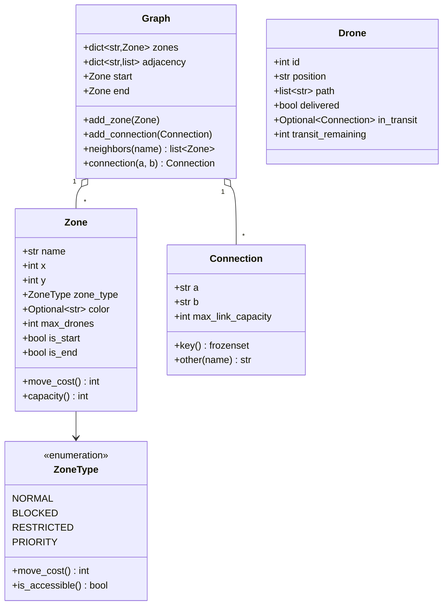
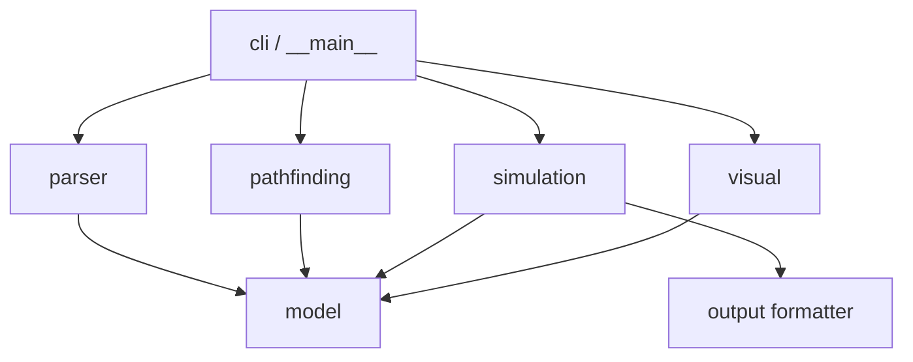
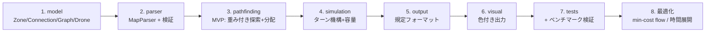

# Fly-in 設計書

> 本書は 42 課題「Fly-in」(Version 1.4) の仕様 PDF を元に作成した実装設計書である。
> 目的: 複数ドローンを `start` ゾーンから `end` ゾーンへ、シミュレーションターン数最小で輸送するシステムを設計する。

---

## 0. 用語

| 用語 | 意味 |
|------|------|
| Zone（ゾーン） | グラフのノード。座標と種別を持つ |
| Connection（接続） | ゾーン間の双方向エッジ |
| Drone（ドローン） | start から end へ移動するエージェント |
| Turn（ターン） | 離散的なシミュレーション単位時間 |
| Move cost | 行き先ゾーン種別ごとの移動コスト（ターン数） |

---

## 1. プロジェクト概要

### 1.1 ゴール
ゾーンの接続ネットワーク（グラフ）と制約集合が与えられたとき、`nb_drones` 機のドローンを
`start` から `end` まで **最小ターン数** で全機輸送するシミュレータを実装する。

本質的には **多エージェント経路探索 / フロー最適化問題**（42 の lem-in の拡張）であり、
以下の追加要素を持つ:

- 移動コストの重み付け（`restricted` = 2 ターン、`normal`/`priority` = 1 ターン）
- ゾーン容量（`max_drones`）
- 接続容量（`max_link_capacity`）
- `restricted` ゾーンへの 2 ターン移動（途中は接続上に滞在）
- 進入不可ゾーン（`blocked`）

### 1.2 スコープ
| 区分 | 内容 |
|------|------|
| 必須 | パーサ、シミュレーションエンジン、経路探索、可視化、規定フォーマット出力 |
| ボーナス | 全提供マップで参照ターン目標を「完全達成」、Challenger マップで 45 ターン記録更新 |

---

## 2. 制約（PDF Chapter V ほか）

| # | 制約 | 設計上の対応 |
|---|------|--------------|
| C1 | グラフ系ライブラリ禁止（networkx, graphlib 等） | グラフ・探索・フローを自前実装 |
| C2 | 完全に型安全（`flake8` + `mypy` 必須） | 全関数に型ヒント、`mypy --strict` を目標 |
| C3 | 完全にオブジェクト指向 | 責務ごとにクラス分割、抽象基底で戦略を差し替え |
| C4 | Python 3.10 以降 | `match` 文・`X | Y` 型union を活用 |
| C5 | 例外を握りつぶさず graceful に処理 | `try/except` と context manager（ファイルは `with`） |
| C6 | docstring（PEP 257 / Google or NumPy style） | 全公開クラス・関数に付与 |
| C7 | Makefile / README.md / .gitignore | 別途整備（§12, §13） |

---

## 3. 入力フォーマット仕様（パーサ要件）

### 3.1 例
```text
nb_drones: 5

start_hub: hub 0 0 [color=green]
end_hub: goal 10 10 [color=yellow]
hub: roof1 3 4 [zone=restricted color=red]
hub: roof2 6 2 [zone=normal color=blue]
hub: corridorA 4 3 [zone=priority color=green max_drones=2]
hub: tunnelB 7 4 [zone=normal color=red]
hub: obstacleX 5 5 [zone=blocked color=gray]
connection: hub-roof1
connection: hub-corridorA
connection: roof1-roof2
connection: roof2-goal
connection: corridorA-tunnelB [max_link_capacity=2]
connection: tunnelB-goal
```

### 3.2 文法
| 行種別 | 構文 |
|--------|------|
| ドローン数 | `nb_drones: <positive_integer>`（最初の有効行） |
| 開始ゾーン | `start_hub: <name> <x> <y> [metadata]` |
| 終了ゾーン | `end_hub: <name> <x> <y> [metadata]` |
| 通常ゾーン | `hub: <name> <x> <y> [metadata]` |
| 接続 | `connection: <name1>-<name2> [metadata]` |
| コメント | `#` 以降は無視 |

### 3.3 メタデータ（`[...]` 内、順不同・全て任意）
**ゾーン:**
- `zone=<type>`（既定 `normal`）— `normal` / `blocked` / `restricted` / `priority`
- `color=<value>`（既定 none）— 単語文字列（許可リストなし）
- `max_drones=<number>`（既定 `1`）— 同時占有可能数

**接続:**
- `max_link_capacity=<number>`（既定 `1`）— 同時通過可能数

### 3.4 検証ルール（違反は行番号と原因を示してエラー停止）
1. 最初の有効行は `nb_drones: <正整数>`。
2. 任意のドローン数を扱えること。
3. `start_hub` と `end_hub` はちょうど 1 つずつ。
4. ゾーン名は一意、座標は整数。
5. ゾーン名にダッシュ `-`・空白は使用不可。
6. 接続は **定義済みゾーン同士のみ** をリンク。
7. 同一接続の重複禁止（`a-b` と `b-a` は重複扱い）。
8. メタデータブロックは構文的に妥当であること。
9. ゾーン種別は 4 種のいずれか。不正値はパースエラー。
10. 容量値（`max_drones`, `max_link_capacity`）は正整数。
11. その他のパースエラーも行番号と原因を明示して停止。

> ⚠️ 座標は常に整数、`start`/`end` は常に一意に存在する（前提保証あり）。

---

## 4. ドメインモデル（クラス設計）

### 4.1 クラス図



### 4.2 各クラスの責務

| クラス | 責務 |
|--------|------|
| `ZoneType`(Enum) | 種別と移動コスト・進入可否のマッピング |
| `Zone` | ノードの属性保持、容量・コストの算出 |
| `Connection` | エッジの属性保持、容量・端点解決 |
| `Graph` | 隣接構造の保持と近傍照会（グラフ操作の単一窓口） |
| `Drone` | エージェント状態（現在地 / 経路 / 配送済み / 移動中） |

### 4.3 移動コスト表（行き先ゾーン種別で決定）

| 種別 | コスト | 備考 |
|------|--------|------|
| `normal` | 1 ターン | 既定 |
| `priority` | 1 ターン | 経路探索で **優先** すべき |
| `restricted` | 2 ターン | 途中 1 ターンは接続上に滞在 |
| `blocked` | — | 進入不可。通る経路は無効 |

---

## 5. システム・アーキテクチャ

### 5.1 モジュール構成

```text
flyin/
├── __main__.py              # エントリポイント（python -m flyin map.txt）
├── cli.py                   # 引数解析・実行制御
├── parser/
│   ├── map_parser.py        # MapParser: テキスト → Graph
│   └── errors.py            # ParseError(line, reason)
├── model/
│   ├── zone.py              # Zone, ZoneType
│   ├── connection.py        # Connection
│   ├── graph.py             # Graph
│   └── drone.py             # Drone
├── pathfinding/
│   ├── strategy.py          # PathStrategy（抽象基底）
│   ├── weighted_search.py   # 重み付き最短路（Dijkstra/SPFA）
│   ├── flow_router.py       # 最小費用流による多経路割当
│   └── allocator.py         # ドローンの経路割当（lem-in 分配）
├── simulation/
│   ├── engine.py            # SimulationEngine（ターン進行の統括）
│   ├── state.py             # SimulationState（占有状況）
│   └── scheduler.py         # MovementScheduler（同時移動の整合判定）
├── visual/
│   ├── renderer.py          # Renderer（抽象基底）
│   └── terminal_renderer.py # 色付きターミナル出力
└── output/
    └── formatter.py         # ターン出力フォーマッタ
```

### 5.2 レイヤ依存（上が下に依存）



`model` は他に依存しない純粋ドメイン。`parser`/`pathfinding`/`simulation`/`visual` は `model` に依存する。

---

## 6. 経路探索・スケジューリングアルゴリズム（中核）

### 6.1 問題の性質
最小ターン数で N 機を運ぶ問題は、容量制約のないlem-inでは
「複数の素な経路へドローンを分配する流量問題」に帰着する。本課題は

- 辺・頂点に **容量**（`max_link_capacity` / `max_drones`）
- 種別ごとの **重み**（`restricted`=2）

があるため、**容量付き・重み付きの最小費用流（min-cost flow）** が定式化として最も厳密。

### 6.2 グラフ変換
1. **頂点容量 → 辺容量**: 各ゾーン `v` を `v_in → v_out`（容量 = `max_drones`、`start`/`end` は ∞）に分割。
2. **接続容量**: 双方向辺をそれぞれ容量 `max_link_capacity` の有向辺に。
3. **重み**: 行き先ゾーン種別のコストを辺の費用に。`priority` は同コストだが探索時に優先選択するためのタイブレークを与える。
4. `blocked` ゾーンは展開しない（不到達化）。

### 6.3 段階的設計（MVP → 最適化）

**段階1（MVP / 確実に動く）**
- 重み付き BFS/Dijkstra で複数の経路候補を抽出（容量を消費しながら反復）。
- lem-in 分配式でターン数を最小化（§6.4）。
- ターンごとにシミュレーション実行（§7）。

**段階2（最適化）**
- 最小費用流（SPFA / Bellman–Ford ベースの successive shortest path）で
  容量と重みを同時に最適化した経路集合を構築。
- `restricted` の 2 ターン滞在は **時間展開グラフ**（time-expanded）で表現可能。

### 6.4 ドローン分配（lem-in 分配式）
素な経路集合 `{P_i}`（各長さ = 到達コスト `L_i`）に対し、経路 `i` に `k_i` 機を流すと
完了は概ね `L_i + k_i − 1` ターン。`Σ k_i = N` のもとで `max_i(L_i + k_i − 1)` を最小化する。

- **二分探索**: 目標 `T` ターンで経路 `i` が運べる数は `max(0, T − L_i + 1)`。
  `Σ ≥ N` を満たす最小 `T` を二分探索。
- 容量制約下では各ターンの流入量が `max_link_capacity` で頭打ちになる点を加味。

### 6.5 戦略の差し替え（OOP / C3 対応）
```python
class PathStrategy(ABC):
    @abstractmethod
    def route(self, graph: Graph, nb_drones: int) -> list[DronePlan]: ...
```
`WeightedDisjointStrategy`（MVP）と `MinCostFlowStrategy`（最適化）を実装し、
マップ規模・形状に応じて選択（PDF「different maps may require different routing strategies」に対応）。

---

## 7. シミュレーションエンジン（ターン機構）

### 7.1 占有・容量ルール（PDF VII.2）
- 既定: 1 ゾーン同時 1 機。`max_drones=N` で N 機。
- `start`: 全機が初期共有可。`end`: 何機到着しても可（配送済み扱い）。
- 同一接続を同時通過できるのは `max_link_capacity` 機まで。
- 全容量制約を満たす限りドローンは **同時移動** 可。

### 7.2 1 ターンで各ドローンが取れる行動（PDF VII.3）
1. 隣接ゾーンへ移動（容量が許せば）。
2. `restricted` ゾーンへ向かう接続へ進入（2 ターン要）。
   この場合 **次ターンに必ず目的地へ到達** しなければならず、接続上で余分に待てない。
3. その場で待機。

### 7.3 同時性の整合判定
ターン状態を逐次評価し衝突を防ぐ:
- あるターンに **退出する** ドローンはそのターンのうちに容量を解放する。
- 移動先は（退出機が空けた後に）空き容量があること。
- 接続容量も同時に検査。

**判定アルゴリズム（1 ターン分）:**
```
1. 各ドローンの希望移動を収集（経路に基づく）
2. 退出後のゾーン残容量・接続残容量を計算
3. 容量超過する移動は保留（その機は待機）
4. デッドロック回避: 進めない機は待機、巡回参照を検出
5. 確定した移動を適用し、出力フォーマッタへ渡す
```

### 7.4 restricted 移動の状態遷移
```
ターン t   : Drone は接続 a-R に進入 → 出力 "D<ID>-<a-R>"（飛行中）
ターン t+1 : Drone は R へ到達       → 出力 "D<ID>-R"
```
飛行中は接続容量を 1 消費し続ける。途中ゾーン容量は消費しない。

---

## 8. 出力フォーマット（PDF VII.5）

- 1 ターン = 1 行。
- その行にはそのターンに発生した全移動を **スペース区切り** で列挙。
- 各移動: `D<ID>-<zone>`、または restricted へ飛行中なら `D<ID>-<connection>`。
- 動かなかった機はその行から省略。
- `end` 到達機は配送済みとして以後追跡しない。
- 全機到達でシミュレーション終了。

**例:**
```text
D1-roof1 D2-corridorA
D1-roof2 D2-tunnelB
D1-goal D2-goal
```

---

## 9. 可視化（PDF VII.1 / Visual Representation）

必須要件として、以下のいずれかで視覚的フィードバックを提供:
- **色付きターミナル出力**: ゾーンの色（`color=` 指定）・状態・各ターンのドローン位置を表示。
- グラフィカル UI（任意）。

設計:
```python
class Renderer(ABC):
    @abstractmethod
    def render_turn(self, state: SimulationState, turn: int) -> None: ...
```
- `TerminalRenderer`: ANSI カラーでゾーン種別/色を着色、凡例を表示。
- 色未指定ゾーンは既定表示。`blocked` は明示的に区別。

---

## 10. スコアリングと性能目標（PDF VII.6 / VII.7）

### 10.1 主指標
全ドローンを start → end へ運ぶ **総ターン数**（少ないほど良い）。

有効なシミュレーションの条件:
- 全移動・占有ルールに準拠
- ゾーン種別の移動コストを正しく処理
- 全容量制約（ゾーン・接続）を遵守
- 全ての衝突を回避

### 10.2 副指標（任意・出力やドキュメントで提示推奨）
- 1 ターンあたり移動機数（経路割当の効率）
- 1 機あたり平均ターン数
- 総経路コスト（重み付き移動コストの総和）

### 10.3 性能ベンチマーク

| 難度 | マップ | 目標 |
|------|--------|------|
| Easy | Linear path (2 drones) | ≤ 6 turns |
| Easy | Simple fork (4 drones) | ≤ 8 turns |
| Easy | Basic capacity (4 drones) | ≤ 6 turns |
| Medium | Dead end trap (5 drones) | ≤ 12 turns |
| Medium | Circular loop (6 drones) | ≤ 15 turns |
| Medium | Priority puzzle (5 drones) | ≤ 12 turns |
| Hard | Maze nightmare (8 drones) | ≤ 30 turns |
| Hard | Capacity hell (12 drones) | ≤ 35 turns |
| Hard | Ultimate challenge (15 drones) | ≤ 45 turns |
| Challenger（任意） | The Impossible Dream (25 drones) | 参照記録 45 turns を更新 |

一般目標: Easy < 10、Medium 10–30、Hard < 60 ターン。

---

## 11. エラーハンドリング方針

| 場面 | 方針 |
|------|------|
| ファイル I/O | `with open(...)` で context manager 管理（C5） |
| パースエラー | `ParseError(line_no, reason)` を送出、明確なメッセージで停止 |
| 不正な実行時状態 | 例外で握りつぶさず、原因を提示 |
| レビュー時クラッシュ | 「非機能」と見なされるため、未捕捉例外を排除 |

---

## 12. テスト戦略（PDF III.3）

`pytest`（または `unittest`）で機能検証（提出・採点対象外だが品質担保に必須）。

| 対象 | 観点 |
|------|------|
| パーサ | 正常系 / 各検証ルール違反 / メタデータ順不同 / コメント / 重複接続 |
| グラフ | 隣接構築 / 近傍照会 / blocked 除外 |
| 経路探索 | 最短性 / priority 優先 / 容量消費 / 分配式の正しさ |
| シミュレーション | 占有・接続容量 / restricted 2 ターン遷移 / 同時移動整合 / デッドロック回避 |
| 出力 | フォーマット準拠 / 終了条件 |
| ベンチマーク | 各提供マップで目標ターン以内 |

> 推奨: 提供マップに加え、エッジケース・エラー処理用の自作マップを用意。

---

## 13. ツール・ビルド（PDF III.2）

### 13.1 Makefile ルール
| ルール | 内容 |
|--------|------|
| `install` | 依存導入（`uv sync` 等） |
| `run` | メインスクリプト実行（`uv run python -m flyin <map>`） |
| `debug` | `pdb` でデバッグ実行 |
| `clean` | `__pycache__`, `.mypy_cache` 等の削除 |
| `lint` | `flake8 .` と `mypy . --warn-return-any --warn-unused-ignores --ignore-missing-imports --disallow-untyped-defs --check-untyped-defs` |
| `lint-strict`（任意） | `flake8 .` と `mypy . --strict` |

> 現状の `Makefile` は `run`/`debug`/`clean` のターゲット本体が未完（`uv eun` の誤記、対象未指定）。実装時に修正する。

### 13.2 .gitignore
Python アーティファクト（`__pycache__/`, `*.pyc`, `.mypy_cache/`, `.venv/` 等）を除外。

---

## 14. README 要件（PDF Chapter VIII）

ルートの `README.md`（英語）に最低限以下を含める:
1. 1 行目（イタリック）: *This project has been created as part of the 42 curriculum by <login>.*
2. **Description**: 目的と概要。
3. **Instructions**: コンパイル / インストール / 実行方法。
4. **Resources**: 参考文献、および **AI をどのタスク・どの部分に使ったか** の明記。
5. アルゴリズム選択と実装戦略の詳細説明。
6. 可視化機能の説明とそれが UX をどう向上させるか。

---

## 15. 実装ロードマップ（推奨順序）



| 段階 | 完了条件（検証エビデンス） |
|------|---------------------------|
| 1–2 | 提供マップを正しく Graph 化、検証ルール全件テスト緑 |
| 3–5 | Easy マップで規定フォーマット出力・目標ターン以内 |
| 6 | 色付き出力でゾーン状態とドローン移動が確認可能 |
| 7 | Medium/Hard ベンチマーク達成、`make lint` 通過 |
| 8（任意） | 全マップ「完全達成」、Challenger 45 ターン更新に挑戦 |

---

## 16. 主要な設計判断と理由

| 判断 | 理由 |
|------|------|
| グラフ・フローを自前実装 | C1（ライブラリ禁止）。隣接リスト + 自前 Dijkstra/最小費用流 |
| 頂点分割で容量を辺に集約 | `max_drones` を標準的なフロー問題に帰着でき、実装と検証が容易 |
| `PathStrategy` の抽象化 | C3（OOP）+ マップ依存の戦略切替要件に対応 |
| MVP→最適化の二段構え | まず全制約準拠の正しい解を出し、その後ターン数を削る（評価のリスク最小化） |
| 時間展開による restricted 表現 | 2 ターン滞在・接続占有を時間軸で厳密にモデル化できる |

---

## 17. 未確定事項 / 確認ポイント

実装着手前に以下を確定させる:
1. **接続名の出力表記**: restricted へ飛行中の `D<ID>-<connection>` で、接続名をどう文字列化するか
   （端点から `name1-name2` 形式を生成する想定だが、評価マップの期待に合わせる）。
2. 可視化を **ターミナルのみ** とするか **GUI も** 用意するか（採点・工数次第）。
3. 最適化段階（min-cost flow / 時間展開）をどこまで実装するか（ボーナス到達目標との兼ね合い）。
4. `priority` ゾーンの「優先」の厳密な解釈（同コスト時のタイブレーク強度）。
