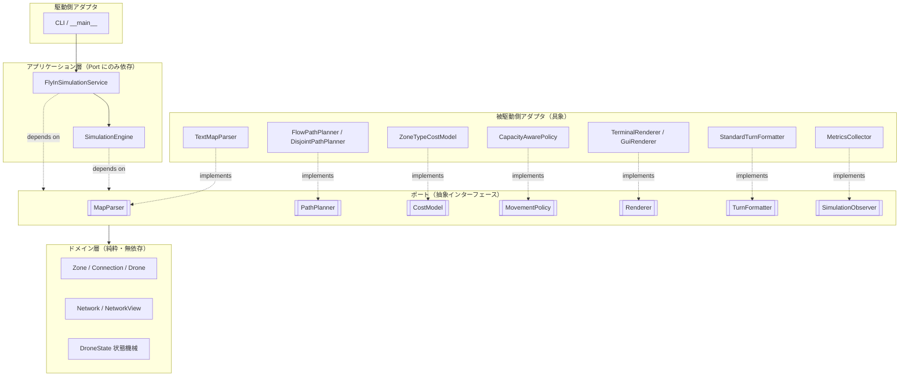
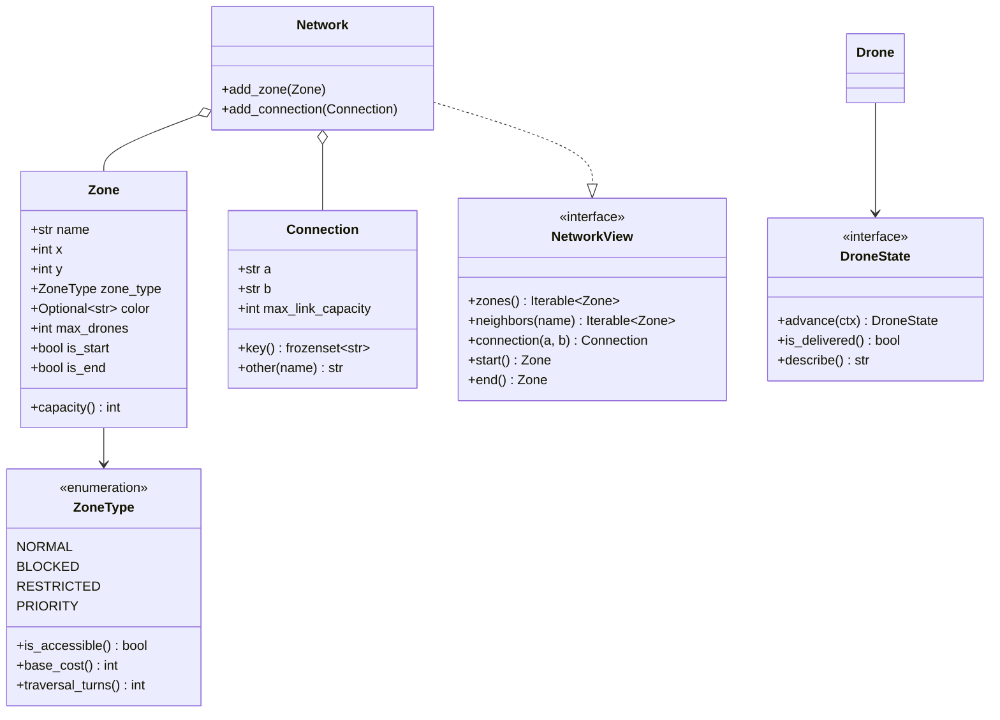
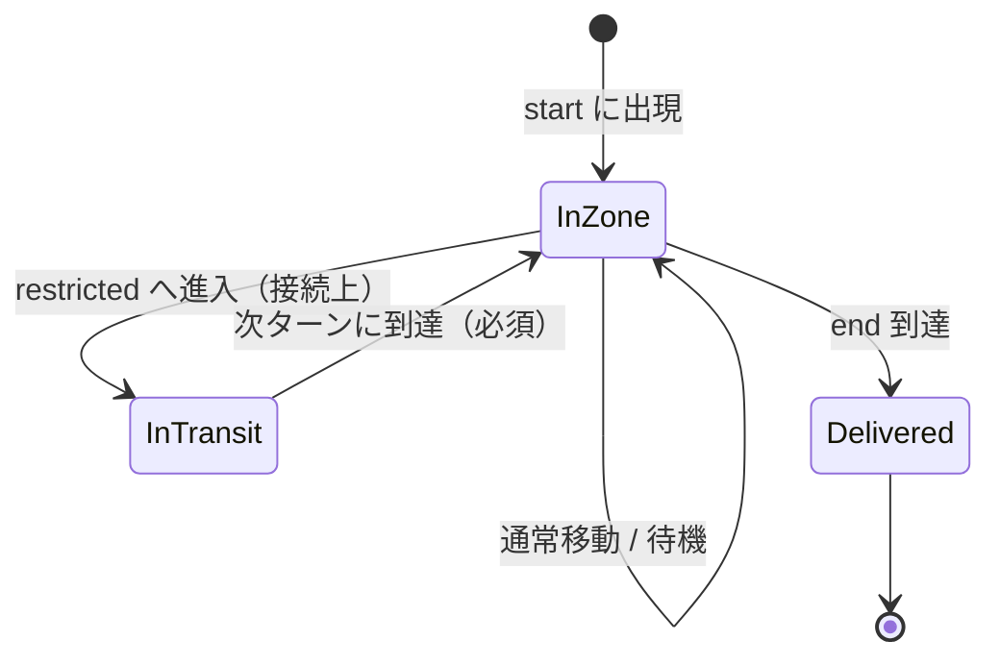
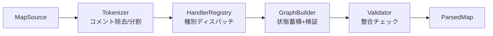
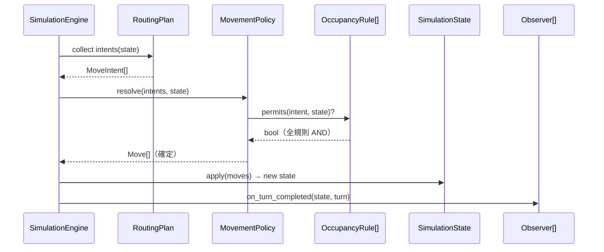
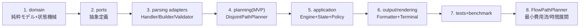

# Fly-in 設計書（抽象化主導版）

> 本書は 42 課題「Fly-in」(Version 1.4) の仕様 PDF を元に作成した実装設計書である。
> 目的: 複数ドローンを `start` ゾーンから `end` ゾーンへ、シミュレーションターン数最小で輸送するシステムを設計する。
> 本版は **「コードの抽象化」を第一原理** として、インターフェース駆動・依存性逆転・差し替え可能性を軸に設計する。

---

## 0. 用語

| 用語 | 意味 |
|------|------|
| Zone（ゾーン） | グラフのノード。座標と種別を持つ |
| Connection（接続） | ゾーン間の双方向エッジ |
| Drone（ドローン） | start から end へ移動するエージェント |
| Turn（ターン） | 離散的なシミュレーション単位時間 |
| Port | 外界とやり取りする抽象インターフェース（ABC / Protocol） |
| Adapter | Port の具象実装 |

---

## 1. プロジェクト概要

ゾーンの接続ネットワークと制約集合が与えられたとき、`nb_drones` 機を
`start` から `end` へ **最小ターン数** で全機輸送するシミュレータを実装する。
本質は **容量・重み付きの多エージェント経路最適化問題**（42 lem-in の拡張）。

追加要素: 重み付き移動（`restricted`=2 ターン）、ゾーン容量（`max_drones`）、
接続容量（`max_link_capacity`）、`restricted` への 2 ターン滞在、進入不可（`blocked`）。

---

## 2. 抽象化の設計原則

### 2.1 指針
本設計は以下を抽象化の物差しとする。**抽象は要件によって正当化されたときのみ導入** し、
投機的抽象（YAGNI 違反）は避ける（§18 参照）。

| 原則 | 本プロジェクトでの適用 |
|------|------------------------|
| **SRP**（単一責任） | 「解析」「経路計画」「移動判定」「描画」「出力整形」を別クラスに分離 |
| **OCP**（開放閉鎖） | 新ゾーン種別・新探索戦略・新レンダラを **既存コード非改変** で追加（§13） |
| **LSP**（置換可能） | 同一 Port のどの Adapter も差し替え可能（テストではフェイクに置換） |
| **ISP**（インターフェース分離） | 読み取り専用 `NetworkView` と変更可能 `GraphBuilder` を分離 |
| **DIP**（依存性逆転） | アプリ層（`SimulationEngine`）は具象でなく **Port にのみ依存**。具象は外部から注入 |

### 2.2 各抽象を導入する根拠（要件トレース）
| 抽象 | 正当化する仕様 |
|------|----------------|
| `PathPlanner`（経路戦略） | 「different maps may require different routing strategies」+ MVP→最適化の二段構え |
| `CostModel`（コスト方策） | ゾーン種別ごとにコストが変わる／`priority` 優先など方策が変動 |
| `Renderer`（描画） | 「terminal colors and/or graphical interface」= 複数実装が要件 |
| `LineHandler`（行解析） | 5 種の行種別＋将来拡張。種別追加を OCP で吸収 |
| `OccupancyRule`（占有規則） | ゾーン容量・接続容量・start/end 例外という独立規則の合成 |
| `SimulationObserver`（観測者） | 描画・ログ・メトリクス収集をエンジンから分離 |

> これらはいずれも「複数実装が存在する」「将来増える」「テストで差し替えたい」のいずれかを満たす。
> 単一実装で増えないものは抽象化しない。

---

## 3. アーキテクチャ全体（ポート & アダプタ / ヘキサゴナル）



**要点:** 中央（アプリ＋ドメイン）は具象を知らない。具象アダプタは Port を実装し、
組み立て（依存注入）は最外周の **Composition Root**（`cli.py` / `bootstrap.py`）でのみ行う。

---

## 4. ドメイン層（純粋・他に依存しない）

### 4.1 クラス図



### 4.2 設計判断: ゾーン種別は「enum + 振る舞い」
`ZoneType` を単なる定数でなく **振る舞いを持つ列挙**（`is_accessible()`, `traversal_turns()`）とする。
種別ごとの分岐（`if zone_type == ...`）をクラス内に閉じ込め、呼び出し側を種別非依存に保つ
（種別追加時の影響範囲を局所化＝OCP に寄与）。
ただし「コストの数値方策」は変動要件のため `ZoneType` に固定せず `CostModel`（§9.2）へ委譲する。

### 4.3 設計判断: 読み取り / 変更の分離（ISP）
- `NetworkView`（読み取り専用 Port）: 経路探索・シミュレーションが依存。
- `Network`（`NetworkView` を実装し変更操作を追加）: パーサ／ビルダのみが使用。

→ 経路探索器がグラフを破壊的変更できない構造を **型レベルで保証**。

### 4.4 設計判断: ドローン状態は State パターン
ドローンの状態を `InZone` / `InTransit`（restricted 飛行中）/ `Delivered` の状態オブジェクトで表現。
各状態が `advance()` で次状態を返す状態機械にし、`if in_transit:` 等の条件分岐を排除する。



---

## 5. ポート（抽象インターフェース）カタログ

各 Port は ABC（`abc.ABC` + `@abstractmethod`）または `typing.Protocol` で定義する。
構造的型付けで十分なもの（`Renderer`, `SimulationObserver`）は `Protocol`、
明示的継承を強制したいもの（`PathPlanner`, `MapParser`）は ABC とする。

```python
class MapParser(ABC):
    """マップ記述（テキスト）をドメインモデルへ変換する。"""
    @abstractmethod
    def parse(self, source: MapSource) -> ParsedMap: ...

class PathPlanner(ABC):
    """ネットワークとドローン数から経路計画を生成する戦略。"""
    @abstractmethod
    def plan(self, view: NetworkView, nb_drones: int,
             cost: CostModel) -> RoutingPlan: ...

class CostModel(ABC):
    """ゾーン/接続に対する移動コスト方策（priority 優先などを内包）。"""
    @abstractmethod
    def move_cost(self, dest: Zone) -> int: ...
    @abstractmethod
    def preference(self, dest: Zone) -> int: ...  # タイブレーク用

class MovementPolicy(ABC):
    """1 ターン分の希望移動を、容量規則に基づき確定移動へ解決する。"""
    @abstractmethod
    def resolve(self, intents: Sequence[MoveIntent],
                state: SimulationState) -> list[Move]: ...

class OccupancyRule(ABC):
    """個々の占有/容量制約。Chain of Responsibility で合成される。"""
    @abstractmethod
    def permits(self, move: MoveIntent, state: SimulationState) -> bool: ...

class Renderer(Protocol):
    def render_turn(self, state: SimulationState, turn: int) -> None: ...

class TurnFormatter(ABC):
    """確定移動を規定の出力フォーマットへ整形する。"""
    @abstractmethod
    def format_turn(self, moves: Sequence[Move]) -> str: ...

class SimulationObserver(Protocol):
    def on_turn_completed(self, state: SimulationState, turn: int) -> None: ...
    def on_finished(self, summary: SimulationSummary) -> None: ...
```

**データ転送オブジェクト（DTO / 値オブジェクト、不変）:**
`ParsedMap`, `RoutingPlan`, `DronePlan`, `MoveIntent`, `Move`, `SimulationSummary`
— いずれも `@dataclass(frozen=True)` とし、層間の契約を明示する。

---

## 6. アプリケーション層

### 6.1 Composition Root（依存注入の唯一の場所）
具象の選択と組み立ては `cli.py`（または `bootstrap.py`）に集約。
それ以外のモジュールは `import` で具象を直接掴まない。

```python
def build_simulation(args: CliArgs) -> SimulationService:
    parser:   MapParser   = TextMapParser()
    cost:     CostModel    = ZoneTypeCostModel()
    planner:  PathPlanner  = select_planner(args)        # Factory（§9.3）
    policy:   MovementPolicy = CapacityAwarePolicy(default_rules())
    renderer: Renderer     = renderer_for(args)          # Factory（§11）
    formatter: TurnFormatter = StandardTurnFormatter()
    observers = [renderer_observer(renderer), MetricsCollector()]
    return SimulationService(parser, planner, cost, policy, formatter, observers)
```

### 6.2 SimulationEngine（Template Method）
ターン進行の骨格を基底に固定し、可変点（移動解決・観測通知）をフックに委譲する。

```python
class SimulationEngine:
    def __init__(self, policy: MovementPolicy,
                 formatter: TurnFormatter,
                 observers: Sequence[SimulationObserver]) -> None: ...

    def run(self, view: NetworkView, plan: RoutingPlan) -> SimulationSummary:
        state = SimulationState.initial(view, plan)
        turn = 0
        while not state.all_delivered():
            intents = self._collect_intents(state, plan)   # 計画→希望移動
            moves = self.policy.resolve(intents, state)     # 容量規則で確定
            state = state.apply(moves)                      # 不変更新
            self.formatter.format_turn(moves)               # 規定出力
            self._notify(state, turn)                       # Observer
            turn += 1
        return state.summarize()
```

`run()` は具象アルゴリズムを一切持たず、注入された Port を呼ぶだけ（DIP の体現）。

---

## 7. パーサの抽象化（Registry + Builder + Factory）

### 7.1 行ハンドラのレジストリ
行種別ごとに `LineHandler` を実装し、レジストリへ登録。新種別は実装＋登録のみで追加（OCP）。

```python
class LineHandler(ABC):
    @abstractmethod
    def matches(self, token: str) -> bool: ...
    @abstractmethod
    def handle(self, line: ParsedLine, builder: GraphBuilder) -> None: ...

# 具象: NbDronesHandler, StartHubHandler, EndHubHandler,
#       HubHandler, ConnectionHandler, CommentHandler
```

### 7.2 解析パイプライン


- `MetadataParser`: `[zone=... color=... max_drones=...]` を順不同で解釈（`ZoneFactory` が消費）。
- `ZoneFactory`: トークン → `Zone` 生成（種別文字列 → `ZoneType` のマッピングを単一箇所に集約）。
- `GraphBuilder`: 接続は「定義済みゾーン参照」を保証しつつ蓄積。
- `Validator`: §3.4 の全検証ルールを `ValidationRule` の集合として適用。

### 7.3 検証ルールの抽象化（Chain / Composite）
```python
class ValidationRule(ABC):
    @abstractmethod
    def check(self, draft: MapDraft) -> None:  # 違反時に ParseError 送出
        ...
# 例: UniqueZoneNames, SingleStartEnd, NoDuplicateConnection,
#     ValidCoordinates, PositiveCapacities, KnownZoneType ...
```
各ルールが独立クラスなので、ルール単体テストが容易（抽象化の直接的利点）。

### 7.4 エラー型
```python
class ParseError(Exception):
    def __init__(self, line_no: int, reason: str) -> None: ...
```
行番号と原因を必ず保持し、メッセージを明確化（仕様: 行番号と原因を示して停止）。

---

## 8. ドメイン仕様（パーサ/シミュレータが満たすべき規則）

### 8.1 入力フォーマット
```text
nb_drones: 5
start_hub: hub 0 0 [color=green]
end_hub: goal 10 10 [color=yellow]
hub: roof1 3 4 [zone=restricted color=red]
hub: corridorA 4 3 [zone=priority color=green max_drones=2]
connection: hub-roof1
connection: corridorA-tunnelB [max_link_capacity=2]
```

| 行 | 構文 |
|----|------|
| ドローン数 | `nb_drones: <正整数>`（最初の有効行） |
| 開始 / 終了 | `start_hub: <name> <x> <y> [meta]` / `end_hub: ...` |
| 通常ゾーン | `hub: <name> <x> <y> [meta]` |
| 接続 | `connection: <name1>-<name2> [meta]` |
| コメント | `#` 以降無視 |

メタデータ（順不同・任意）: `zone=`（既定 normal）/ `color=`（既定 none）/
`max_drones=`（既定 1）/ 接続は `max_link_capacity=`（既定 1）。

### 8.2 検証ルール（§7.3 の各 `ValidationRule` に対応）
1. 最初の有効行は `nb_drones: <正整数>`／任意数を扱える。
2. `start_hub`・`end_hub` は各 1 つ。
3. ゾーン名一意・座標整数・名前にダッシュ/空白不可。
4. 接続は定義済みゾーン同士・重複禁止（`a-b`＝`b-a`）。
5. 種別は 4 種のいずれか・容量は正整数・メタは構文妥当。
6. 違反は行番号と原因を示して停止。

### 8.3 移動コスト
| 種別 | コスト | 備考 |
|------|--------|------|
| normal | 1 | 既定 |
| priority | 1 | 探索で優先 |
| restricted | 2 | 途中 1 ターン接続上 |
| blocked | — | 進入不可 |

### 8.4 占有・移動規則（VII.2 / VII.3）
- 既定 1 機 / `max_drones=N` で N 機。`start` 共有可・`end` 無制限（配送済み）。
- 接続同時通過は `max_link_capacity` 機まで。
- 退出機は同ターンに容量解放 → 解放後に空きがあれば進入可。
- 1 ターンの行動: 隣接移動 / restricted への進入（次ターン必着・接続で待てない）/ 待機。

---

## 9. 経路探索の抽象化

### 9.1 戦略インターフェース（Strategy）
`PathPlanner.plan()` が `RoutingPlan`（各ドローンの経路と発進タイミング）を返す。
具象を 2 つ用意し、`PlannerSelector`（§9.3）で切替:

| Adapter | 内容 | 段階 |
|---------|------|------|
| `DisjointPathPlanner` | 重み付き探索で素な経路を反復抽出＋lem-in 分配 | MVP |
| `FlowPathPlanner` | 容量・重みを最小費用流で同時最適化（頂点分割・時間展開） | 最適化 |

### 9.2 コスト方策（CostModel）
コストを `ZoneType` に固定せず `CostModel` に外出し。
`ZoneTypeCostModel` が `normal/priority=1, restricted=2` を返し、`priority` には高い `preference()` を付与。
→ 「priority の優先度を調整したい」「実験的に重みを変えたい」を **アルゴリズム非改変** で吸収。

### 9.3 戦略選択（Factory）
```python
def select_planner(args: CliArgs) -> PathPlanner:
    if args.planner == "flow":
        return FlowPathPlanner()
    if args.planner == "auto":
        return AdaptivePlanner(DisjointPathPlanner(), FlowPathPlanner())  # 規模で選択
    return DisjointPathPlanner()
```
`AdaptivePlanner` はマップ規模・形状で内部戦略を選ぶ（仕様「マップ毎に戦略が異なりうる」に対応）。

### 9.4 アルゴリズム核（実装メモ）
- **頂点容量 → 辺容量**: `v_in→v_out`（容量 `max_drones`、start/end は ∞）。
- **接続容量**: 双方向を容量 `max_link_capacity` の有向辺に。
- **重み**: `CostModel.move_cost` を辺費用に。`blocked` は展開しない。
- **分配（lem-in）**: 経路長 `L_i`、経路 i に `k_i` 機で完了 `≈ L_i + k_i − 1`。
  目標ターン `T` で運べる数 `max(0, T − L_i + 1)`、`Σ ≥ N` を満たす最小 `T` を二分探索。
- **restricted の 2 ターン滞在**: 時間展開グラフで接続占有を厳密表現。

---

## 10. シミュレーションの抽象化

### 10.1 移動の表現（Command + 値オブジェクト）
```python
@dataclass(frozen=True)
class MoveIntent:           # 「こう動きたい」希望
    drone_id: int
    target: Target          # Zone か Connection（restricted 飛行）

@dataclass(frozen=True)
class Move:                 # 「こう動いた」確定
    drone_id: int
    target: Target
```

### 10.2 占有規則の合成（Chain of Responsibility）
`MovementPolicy.resolve()` は各 `MoveIntent` を `OccupancyRule` 群で検査し、
全規則が許可した移動のみ確定。規則は独立クラスで合成・差し替え可能:

| OccupancyRule | 検査内容 |
|---------------|----------|
| `ZoneCapacityRule` | 退出機解放後の `max_drones` 超過なし |
| `LinkCapacityRule` | `max_link_capacity` 超過なし |
| `BlockedZoneRule` | `blocked` 進入禁止 |
| `RestrictedTransitRule` | 飛行中は接続で待てず次ターン必着 |
| `StartEndExemptionRule` | start/end の容量例外 |

### 10.3 状態の不変更新
`SimulationState` は `apply(moves) -> SimulationState` で **新しい状態を返す**（不変）。
これによりターン間の状態をスナップショットとして観測・テストしやすくする。

### 10.4 1 ターンの流れ


---

## 11. 可視化・出力の抽象化（Observer + Strategy）

- 描画は **エンジンから完全分離**: `Renderer` を `SimulationObserver` でラップし、
  `on_turn_completed` で各ターンを描画。エンジンは描画の存在を知らない。
- 具象: `TerminalRenderer`（ANSI カラー、ゾーン `color=`・種別・ドローン位置・凡例）、
  将来の `GuiRenderer`（任意）。`NullRenderer` でヘッドレス実行。
- 出力整形は `TurnFormatter`（規定フォーマット）として独立。描画と出力を混ぜない。

### 11.1 規定出力フォーマット（VII.5）
- 1 ターン = 1 行、移動をスペース区切り。
- 各移動 `D<ID>-<zone>`、restricted 飛行中は `D<ID>-<connection>`。
- 非移動機は省略。end 到達機は以後追跡せず。全機到達で終了。

```text
D1-roof1 D2-corridorA
D1-roof2 D2-tunnelB
D1-goal D2-goal
```

---

## 12. デザインパターン対応表

| パターン | 適用箇所 | 解決する課題 |
|----------|----------|--------------|
| Strategy | `PathPlanner`, `CostModel`, `MovementPolicy` | アルゴリズム/方策の差し替え |
| Factory | `select_planner`, `ZoneFactory`, `renderer_for` | 具象生成の局所化 |
| Template Method | `SimulationEngine.run` | 進行骨格固定＋可変点フック化 |
| State | `DroneState`（InZone/InTransit/Delivered） | 状態分岐の排除 |
| Command / 値オブジェクト | `MoveIntent` / `Move` | 移動の表現と検査の分離 |
| Chain of Responsibility | `OccupancyRule` 群 | 占有規則の独立合成 |
| Observer | `SimulationObserver`（描画/メトリクス） | 横断的関心の分離 |
| Registry | `LineHandler` 群 | 行種別の OCP 追加 |
| Builder | `GraphBuilder` | 段階的なグラフ構築と検証 |
| Adapter（Hexagonal） | 全 Port の具象 | I/O・描画・探索の交換可能化 |

---

## 13. 拡張シナリオ（OCP の実証）

抽象設計の価値は「新要件を **既存コード非改変** で足せること」。代表シナリオ:

| 新要件 | 追加するもの | 変更不要なもの |
|--------|--------------|----------------|
| 新ゾーン種別（例 `slow`=3 ターン） | `ZoneType` メンバ＋`CostModel` 1 行 | エンジン・探索・描画 |
| 新経路アルゴリズム | `PathPlanner` 実装 1 つ＋`select_planner` 分岐 | エンジン・出力 |
| GUI 描画 | `GuiRenderer`（`Renderer` 実装） | エンジン・出力（Observer 経由） |
| 新メタデータ | `MetadataParser` のキー追加＋対応 `ValidationRule` | 他の行ハンドラ |
| 出力フォーマット変更 | `TurnFormatter` 実装差し替え | シミュレーション本体 |
| メトリクス追加 | `SimulationObserver` 実装追加 | エンジン本体 |

---

## 14. ディレクトリ構成（層と抽象に対応）

```text
flyin/
├── __main__.py              # エントリポイント
├── cli.py                   # Composition Root（DI 組み立て）
├── domain/                  # 純粋ドメイン（無依存）
│   ├── zone.py              # Zone, ZoneType
│   ├── connection.py        # Connection
│   ├── network.py           # Network, NetworkView(Protocol)
│   ├── drone.py             # Drone, DroneState(+具象状態)
│   └── dto.py               # ParsedMap, RoutingPlan, Move ...(frozen)
├── ports/                   # 抽象インターフェース（ABC/Protocol）
│   ├── parser.py            # MapParser
│   ├── planner.py           # PathPlanner, CostModel
│   ├── policy.py            # MovementPolicy, OccupancyRule
│   ├── renderer.py          # Renderer, SimulationObserver
│   └── formatter.py         # TurnFormatter
├── adapters/                # 具象実装
│   ├── parsing/             # TextMapParser, LineHandler 群, ZoneFactory,
│   │                        #   MetadataParser, ValidationRule 群, ParseError
│   ├── planning/            # DisjointPathPlanner, FlowPathPlanner,
│   │                        #   AdaptivePlanner, ZoneTypeCostModel
│   ├── policy/              # CapacityAwarePolicy, OccupancyRule 群
│   ├── rendering/           # TerminalRenderer, NullRenderer
│   └── output/              # StandardTurnFormatter, MetricsCollector
└── application/             # アプリ層
    ├── engine.py            # SimulationEngine, SimulationState
    └── service.py           # FlyInSimulationService
```

依存方向: `adapters → ports → domain`、`application → ports → domain`。
**domain は何にも依存しない**（依存性逆転の頂点）。

---

## 15. 型安全とエラー処理（抽象を型で担保）

| 項目 | 方針 |
|------|------|
| 型ヒント | 全関数引数・戻り値・変数。Port は ABC/Protocol で契約を型として明示 |
| mypy | `make lint`（規定フラグ）通過、`mypy --strict` を到達目標 |
| 不変 DTO | `@dataclass(frozen=True)` で層間契約の改変を防止 |
| ファイル I/O | `with open(...)`（context manager）でリーク防止 |
| 例外 | `ParseError`(行番号+原因)、未捕捉例外を排除（レビュー時クラッシュ＝非機能） |
| docstring | 全公開クラス/関数に PEP 257（Google/NumPy style） |

---

## 16. テスト戦略（抽象化の直接的恩恵）

Port を介すため、各層を **フェイク/スタブ差し替え** で単体テスト可能。

| 対象 | テスト手法 |
|------|-----------|
| 各 `ValidationRule` | ルール単体で違反/正常を検証 |
| `LineHandler` | 行単位でビルダ状態の変化を検証 |
| `PathPlanner` | 固定 `NetworkView` フェイクで最短性・分配・priority 優先を検証 |
| `MovementPolicy`/`OccupancyRule` | 合成状態に対し許可/拒否を検証 |
| `SimulationEngine` | フェイク `PathPlanner`＋スパイ `Observer` で進行を検証 |
| `TurnFormatter` | 確定 `Move[]` → 文字列のスナップショット |
| ベンチマーク | 提供マップで目標ターン以内（§17 表） |

`pytest`（または `unittest`）。提供マップに加えエッジ/エラー処理用の自作マップを用意。

---

## 17. 実装ロードマップと性能目標



| 難度 | 目標 |
|------|------|
| Easy（Linear/Fork/Capacity） | ≤ 6 / ≤ 8 / ≤ 6 turns（全体 < 10） |
| Medium（Dead end/Loop/Priority） | ≤ 12 / ≤ 15 / ≤ 12 turns（10–30） |
| Hard（Maze/Capacity hell/Ultimate） | ≤ 30 / ≤ 35 / ≤ 45 turns（< 60） |
| Challenger（任意 Impossible Dream 25機） | 参照記録 45 turns を更新 |

---

## 18. 過剰抽象化の回避指針

抽象化は手段であって目的ではない。本設計では以下を **意図的に抽象化しない**:

- **単一実装で増えないもの**: `Tokenizer`、座標などは具象クラスで十分（Port 化しない）。
- **ドメイン値オブジェクト**: `Zone`/`Connection` はインターフェース化せず素直な `dataclass`。
- **1 箇所でしか使わないヘルパ**: モジュール関数で済ます。

判定基準（いずれかを満たすときのみ Port 化）:
1. 複数の具象実装が現に存在する／確実に増える（探索戦略・描画）。
2. テストで差し替えたい外部 I/O（パーサ入力・描画・出力）。
3. 仕様が明示的に可変性を要求している（戦略・色/GUI）。

---

## 19. 未確定事項 / 確認ポイント

1. **接続名の出力表記**: restricted 飛行中 `D<ID>-<connection>` の接続名文字列化規則
   （`name1-name2` 形式を想定。評価マップの期待に合わせる）。
2. **可視化の範囲**: ターミナルのみ / GUI も（`Renderer` の具象数）。
3. **最適化の到達点**: `FlowPathPlanner`／時間展開をどこまで実装するか（ボーナス目標との兼ね合い）。
4. **priority のタイブレーク強度**: `CostModel.preference()` の重み設計。
5. **Port の実装方式**: ABC と Protocol の使い分け方針の最終確定（§5 の提案でよいか）。

---

## 付録: 既存 Makefile の修正点

現状の `Makefile` は本設計の前に整備が必要:
- `run` / `debug` / `clean` のターゲット本体が未完（対象未指定）。
- `debug` 行の `uv eun`（`uv run` の誤記）。
- 実装後、`run` は `uv run python -m flyin <map>`、`clean` は `__pycache__`/`.mypy_cache` 削除に修正。
